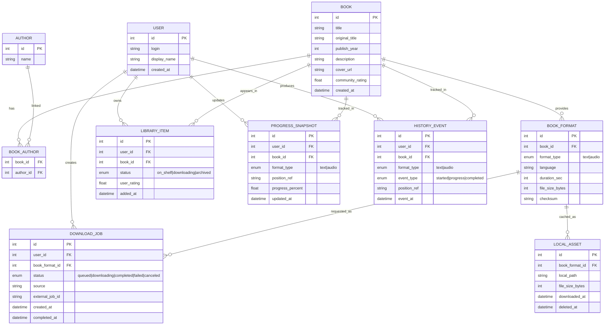

# Bookshelf

## Project Overview
Bookshelf is a cross-platform reading service with web and mobile clients.
Users can read text books and listen to audio books. One book can have both formats.

The product includes:
- a catalog and personal library ("shelf");
- search and download flows for books;
- online and offline reading/listening;
- persistent history of completed and in-progress books.

## Core Product Goals
- Provide a single app for text and audio book consumption.
- Let users find and download books directly from the service.
- Support offline mode for previously downloaded files.
- Keep reading/listening history even if local files are removed to save storage.

## Technology Direction
- Client: .NET MAUI Hybrid Blazor App (shared UI and logic for mobile and desktop/web-hosted experience).
- Backend: ASP.NET Core Web API.
- Database: relational DB (PostgreSQL recommended).
- Authentication: OpenID Connect (Authelia can be used as identity provider).
- Download integration: Jackett (index/search) + qBittorrent API (download management).

## Functional Scope

### 1. Authentication and User Profile
- Sign in/sign out via OpenID Connect.
- User profile with basic preferences (language, playback speed, theme, etc.).
- Optional multi-device sync of positions and history.

### 2. Shelf (Personal Library)
- Show all books added by the user.
- Card/list view includes:
  - cover;
  - title and original title;
  - author(s);
  - year;
  - community/user rating;
  - availability flags (text, audio, both);
  - download state.
- Book details page includes:
  - metadata and description;
  - user rating;
  - current progress (text/audio);
  - actions: read, listen, download, remove local file.

### 3. Find and Download Books
- Search by title and/or author.
- Source metadata from external providers (for example, FantLab API).
- Show normalized search results in the same visual style as shelf items.
- Show available download options:
  - find torrents via Jackett;
  - list candidate torrents with size/seeders;
  - start download via qBittorrent API;
  - track job status (queued/downloading/completed/failed).
- Add book to shelf automatically after metadata is resolved.

### 4. Reader and Audio Player
- Text reader:
  - chapter/page navigation;
  - font and layout settings;
  - auto-save last position.
- Audio player:
  - play/pause/seek/speed;
  - background playback (mobile);
  - auto-save last position.
- If both formats are available for one book, user can switch formats from the same book page.

### 5. Offline Mode
- Users can pre-download text/audio files for offline usage.
- App keeps local index of downloaded assets and their validity.
- Offline behavior:
  - reading/listening is available for downloaded items without network;
  - metadata and history remain visible from local cache;
  - sync starts when connection is restored.
- Users can delete local files without deleting library records or history.

### 6. Reading/Listening History
- Store immutable history events and current progress snapshots.
- Track:
  - who read/listened;
  - when sessions started/ended;
  - progress positions;
  - completion timestamps.
- Critical requirement:
  - history is stored independently from local files, so deleting downloaded files does not remove history.

## High-Level Architecture

### Client Layer (MAUI Hybrid Blazor)
- Shared UI components in Blazor.
- Platform services for file system, audio playback, and connectivity.
- Local storage:
  - SQLite (metadata cache, progress, offline queue);
  - file storage for downloaded text/audio assets.

### Backend Layer
- REST API for users, books, shelf, progress, and history.
- Search adapter layer for external catalog providers.
- Download orchestration service for Jackett + qBittorrent.
- Sync endpoints for conflict-safe position/history merge from offline clients.

### Data Layer
- PostgreSQL as primary source of truth.
- Optional distributed cache for frequent metadata queries.
- Object/file storage can be added later if direct download strategy changes.

## Database Structure (Draft)

## Data Retention Rule
- `HISTORY_EVENT`, `PROGRESS_SNAPSHOT`, and `LIBRARY_ITEM` are persistent product data.
- `LOCAL_ASSET` represents local file presence and may be removed at any time.
- Deleting a local file updates `LOCAL_ASSET.deleted_at` but must not delete history/progress/shelf records.

## API Modules (Draft)
- `AuthController`: sign-in/session/user info.
- `BooksController`: metadata, details, formats.
- `SearchController`: external provider search abstraction.
- `DownloadsController`: start/track/cancel downloads.
- `LibraryController`: shelf operations.
- `ProgressController`: position sync.
- `HistoryController`: history events and statistics.

## Future Enhancements
- Recommendations based on reading/listening history.
- Bookmarks and highlights for text books.
- Cross-device resume with near-real-time sync.
- Admin tools for metadata quality and duplicate merge.
